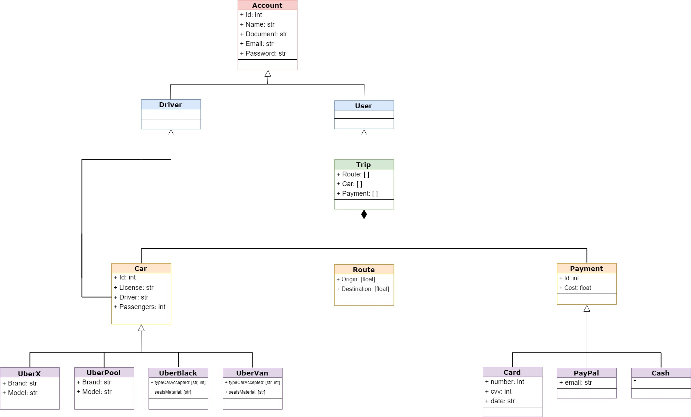
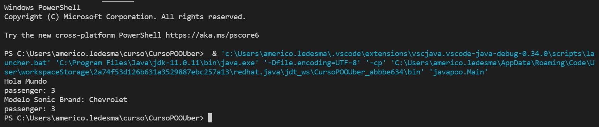

# Object Oriented Programming Course
### Table of contents
* [Introduction](#introduction) 
* [Technologies](#technologies)
* [Syntax](#syntax)
* [Illustrations](#illustrations)


## Introduction
In this course we practice about Object Oriented Programming in 4 different languages.

#### Main topics of this project:
* Classes 
* Objects
* Properties
* Methods
* Abstraction
* Polymorphism
* Inheritance 
* Encapsulation

## Technologies
* Java
* PHP
* Javascript
* Python


## Syntax
#### To Define a Class
##### Java
```
class Person{
String name=””;
void walk(){}
}
```
##### Python
```
class Person:
name=””;
def walk():
```
##### JavaScript
```
Person.prototype.walk ) function(){
}
```
##### PHP
```
class Person{
$name=””;
function walk(){}
}
```

#### Constructor Method
##### Java
```
public Person(String name){
this.name=name;
}
```
##### JavaScript
```
function Person(name){
this.name=name
}
```

##### PHP
```
public function __construct($name){
$this->name=name;
}
```
##### Python
```
def __int__(self,name):
self.name=name
```


#### Getters & Setters example in java
```
public Integer getPassenger()
    {
        return passenger;
    }
    public void setPassenger(Integer passenger)
    {
        if(passenger==4){
            this.passenger = passenger;
        }else{
            System.out.println("Necesitas asignar 4 pasajeros");
        }
    }

```


## Illustrations

In this diagram we practiced the abstraction and graphically we could show the logic of the relations.

**************************************
This is the result of the analyzed project called Uber, where we had mix objects with different data types and use encapsulation and inheritance.


